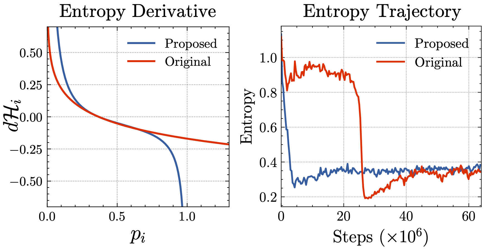
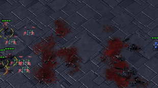

```diff
Important Notes:
- Right now there is some hard-coding in this repo (we have added comments); we will clean up soon
- We'll also add some more comments to improve readability
```

# Learning Implicit Credit Assignment for Cooperative Multi-Agent Reinforcement Learning (LICA)

This repository hosts the official PyTorch implementation of "**Learning Implicit Credit Assignment for Cooperative Multi-Agent Reinforcement Learning**". The implementation is based on the [PyMARL](https://github.com/oxwhirl/pymarl) framework and [SMAC](https://github.com/oxwhirl/smac).

[[PDF](https://arxiv.org/pdf/2007.02529.pdf)]




## Setup

Set up the working environment:

```shell
pip3 install -r requirements.txt
```

Set up the StarCraftII game core

```shell
bash install_sc2.sh
```


## Training

To train `LICA` on the `5m_vs_6m` scenario,

```shell
python3 src/main.py --config=lica --env-config=sc2 with env_args.map_name=5m_vs_6m
```

Change the `map_name` accordingly for other scenarios (e.g. `mmm2`). Remember to update hyperparameters accordingly (e.g. regularization coefficient). All results will be saved in the `results` folder.


## Evaluation

### TensorBoard

The training tensorboards are saved in the `results/tb_logs` directory, containing useful info such as policy entropy trajectory and test battle win rate during training.

### Saving models
Same as PyMARL, set `save_model` to `True` in `src/config/default.yaml` will save the learnt model during training (saved in `result/` directory be default). The frequency for saving models can be adjusted using the parameter `save_model_interval`.

### Loading models
Saved models can be loaded by adjusting the `checkpoint_path` parameter in `src/config/default.yaml`. For instance, to load model under path `result/model/[timesteps]/agent.th`, set `checkpoint_path` to `result/model/[timesteps]`.

### Saving Starcraft II Replay
The learned model loaded from `checkpoint_path` can be evaluated by setting `evaluate` to `True` in `src/config/default.yaml`. To save the Starcraft II replays, please make sure configure `save_replay` to `True`, and use the `episode_runner`.

Check out [PyMARL documentation](https://github.com/oxwhirl/pymarl) for more information.


## Visualizations
The demo videos of two of the best battles performed by LICA agents (red) are available at `visualizations/`. The GIF previews are shown below:


|  5m_vs_6m  |  MMM2  |
|---|---|
|    |    |


## Citation

Please cite this work if you find it useful:
```
@article{zhou2020learning,
  title={Learning Implicit Credit Assignment for Cooperative Multi-Agent Reinforcement Learning}, 
  author={Meng Zhou and Ziyu Liu and Pengwei Sui and Yixuan Li and Yuk Ying Chung},
  journal={arXiv preprint arXiv:2007.02529},
  year={2020}
}
```


## Contact

Please email mzho7212 AT gmail.com and kenziyuliu AT outlook.com for further questions.


## See Also

See [SMAC](https://github.com/oxwhirl/smac) and [PyMARL](https://github.com/oxwhirl/pymarl) for additional instructions.
